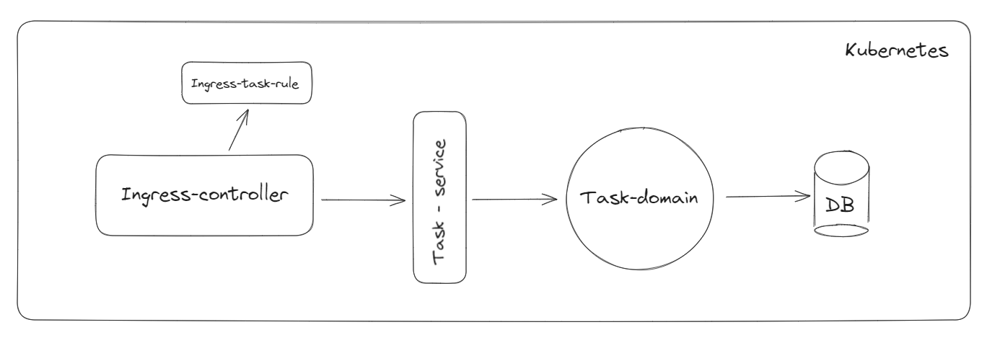

## Components

### Database

The idea of setting a local Database in the cluster was for learning purpose.
This is mostly to hard to manage and be 100% sure you will not lose any data.
That's why in the future the application will adapted to a DB in the cloud

A Persistend volume is created so when the DB pod would restart it would not lose it's data.
A Persisten volume claim is then created to reach the persistend volume
The deployment has all the info to boot up the actual Database
A secret is used for the admin user to create the database in postgres
And at last the service is used so other application can reach the database

### Task-application

This application is used to have a basic Rest service which can be used to setup a basic application setup.
Interactions with this application will grow and will be adapted when they are created.

At this moment this is the only part in the demo-deployment which is prepared for prd acc and dev env.
At this stage it uses the same credentials as the admin of the Database and has to mutch right.

### Ingress-controller + rules

Creates a nginx controller which should allow communication between the cluster and outside.
In the folder /gateway are the rules added for directing the end calls to the right application